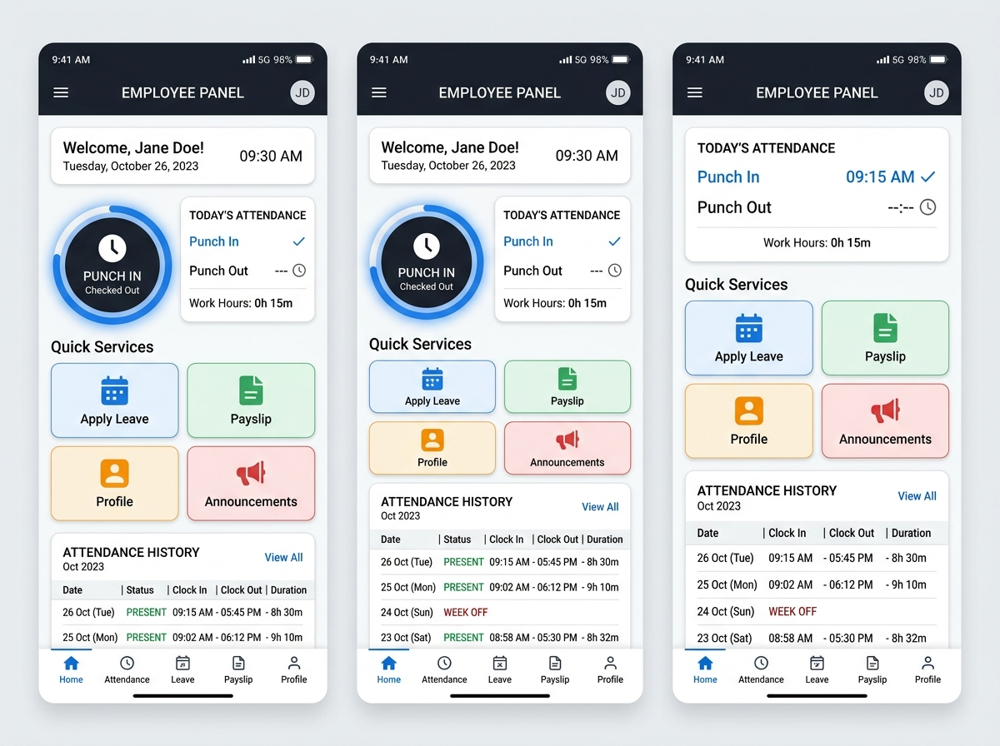
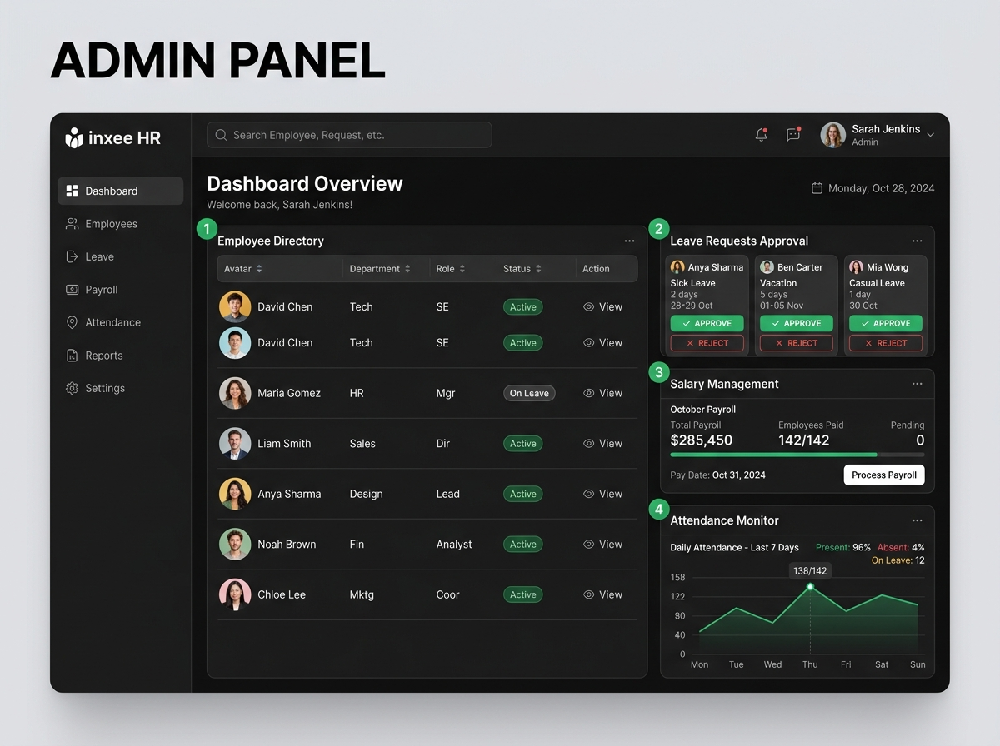

# Inxee Internship HR Demo System

An end-to-end Human Resources (HR) & Attendance Management Application featuring an **Employee Portal**, **Admin Portal**, **Attendance Punch Clock**, **Leave Approval System**, and **Salary Payslip Viewer**. 

This repository includes both a **Flutter Mobile/Desktop Application** and a **Web Application Runner** pre-loaded with an **Offline Local Dummy Dataset** (requiring zero external cloud or Firebase configuration to run immediately).

---

## 📸 Visual Demo Preview

| Employee Dashboard & Punch-In | Admin Management Panel |
| :---: | :---: |
|  |  |

---

## ⚡ Quickstart - Run Locally in Seconds

No Flutter SDK or Firebase setup required! You can run the entire system locally with built-in mock data:

```bash
# Clone the repository
git clone https://github.com/DeepanshuGarhkoti109/Inxee-Internship-HR-Demo-System.git
cd Inxee-Internship-HR-Demo-System

# Start the local server
npm start
# OR using python directly:
# python -m http.server 8080 --directory demo_app
```

Then open your browser and navigate to:
👉 **`http://localhost:8080`**

### 🔑 Demo Login Credentials

| Role | Email | Password | Features Accessible |
| :--- | :--- | :--- | :--- |
| **Employee** | `deepanshuGarhkoti@gmail.com` | `password123` | Punch In/Out, Apply Leave, View Payslip, Profile |
| **Admin** | `admin@inxee.com` | `password123` | Approve Leaves, Manage Employees, Salary Oversight |
| **OTP Login** | Any Phone / Email | `1234` | High security 4-digit OTP demo authentication |

---

## ✨ Key Features

### 👤 Employee Portal
- ⏱️ **Real-Time Punch Clock**: Instant Punch In & Punch Out with automatic daily duration tracking.
- 📅 **Leave Application**: Apply for Full Day, First Half, or Second Half leaves with custom reasons and live approval status tracker.
- 💵 **Digital Payslip & Salary**: Detailed breakdown of Basic Pay, HRA/Allowances, PF/TDS Deductions, and Net Salary.
- 🔐 **Multi-Method Login**: Password or OTP SMS/Email authentication flow.
- 📱 **Profile Management**: View employee code, designation, department, and contact information.

### 🛡️ Admin Portal
- 📊 **Executive Dashboard**: Company-wide attendance stats and metrics.
- ✅ **Leave Approval Workflow**: Review, approve, or reject employee leave applications in real time.
- 👥 **Employee Directory**: Manage workforce, search records, and add new employee profiles.
- 💰 **Salary Disbursement**: Adjust base salary, allowances, and verify net monthly payouts.
- 📑 **Audit Reports**: Submit and review HR helpdesk tickets and system reports.

---

## 💾 Local Dummy Dataset Architecture

The system operates seamlessly offline using a structured local storage schema:

- **Employees**: Pre-configured profiles (Deepanshu Garhkoti, Rahul Sharma, Priya Patel).
- **Attendance**: Historical punch-in/out timestamps and presence logs.
- **Leave Requests**: Mock applications across Pending, Approved, and Rejected states.
- **Salary Data**: Pre-calculated payslips and compensation structures.

*All actions (Punch-in, Applying Leave, Approving Leave, Adding Employees) update the local state in real time.*

---

## 📱 Running with Flutter (Mobile / Desktop)

If you have Flutter installed on your machine:

```bash
# Get dependencies
flutter pub get

# Run on available device (Chrome, Web, Android, iOS, Windows)
flutter run
```

> **Note**: Firebase initialization in `lib/main.dart` is wrapped with an automatic offline fallback catch block so the Flutter app runs without throwing missing configuration errors.

---

## 📁 Repository Structure

```
Inxee-Internship-HR-Demo-System/
├── assets/                  # Demo images and screenshots
│   └── demo/
├── demo_app/                # Web Runner & Local Storage Application
│   ├── index.html           # Main HTML5 App Container
│   ├── styles.css           # Material 3 & Responsive Styling
│   └── app.js               # Application Controller & Local Dataset
├── lib/                     # Flutter Dart Source Code
│   ├── Common_panels/       # Shared Home, Attendance & Profile Screens
│   ├── employee_panels/     # Employee Dashboard & Navigation
│   ├── panels_ADMIN/        # Admin Dashboard, Leave Approval & Salary
│   ├── database/            # SQLite Helper Schemas
│   ├── screens/             # Auth Screens (Login, Admin Login, OTP)
│   └── main.dart            # Flutter Entrypoint
├── package.json             # Web Runner NPM scripts
└── pubspec.yaml             # Flutter Dependencies
```

---

## 📄 License

This project was created for the Inxee Internship HR System project and is licensed under the MIT License.
